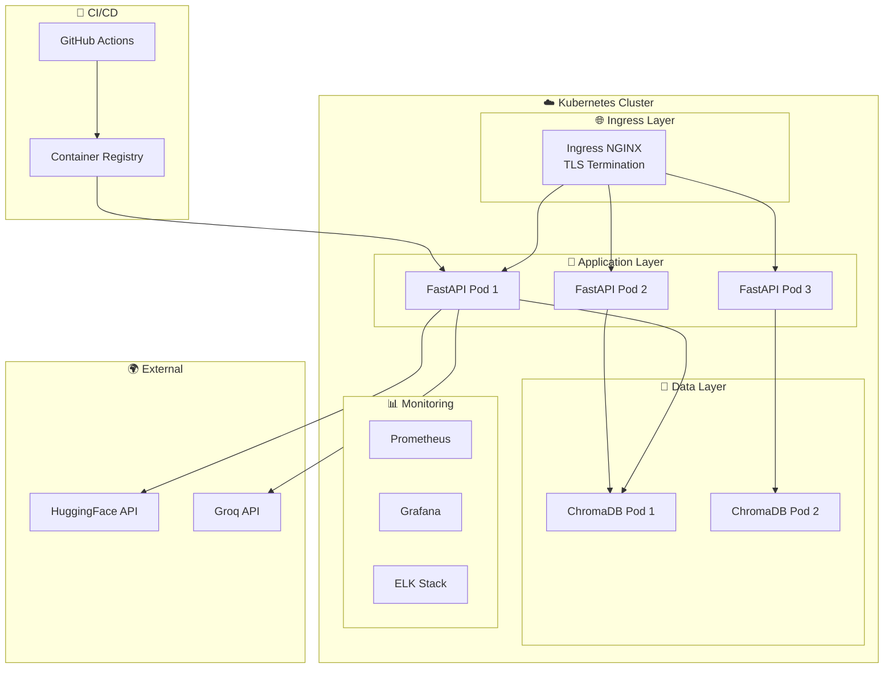

# RAG IT Support System

[](https://github.com/votre-username/rag-it-support/actions)
[](https://codecov.io/gh/votre-username/rag-it-support)
[](https://www.python.org/downloads/)
[](https://github.com/psf/black)

Système de Retrieval-Augmented Generation (RAG) pour le support informatique, utilisant LangChain, ChromaDB et Groq LLM avec déploiement Kubernetes et CI/CD automatisé.

##  Table des matières

- [Aperçu](#aperçu)
- [Fonctionnalités](#fonctionnalités)
- [Architecture](#architecture)
- [Prérequis](#prérequis)
- [Installation](#installation)
- [Configuration](#configuration)
- [Utilisation](#utilisation)
- [CI/CD](#cicd)
- [Déploiement](#déploiement)
- [Supervision & Monitoring](#supervision--monitoring)
- [Tests](#tests)
- [API](#api)
- [Performance](#performance)
- [Dépannage](#dépannage)
- [Contribution](#contribution)
- [Licence](#licence)

##  Aperçu

Ce projet implémente un système RAG (Retrieval-Augmented Generation) spécialisé dans le support IT. Il permet de:
-  Indexer des documents IT support (PDF, etc.)
-  Répondre aux questions techniques basées sur ces documents
-  Fournir des sources pour chaque réponse
-  Déployer sur Kubernetes avec haute disponibilité
-  Monitorer les performances et la santé du système
-  CI/CD automatisé avec GitHub Actions

##  Fonctionnalités

### Core Features
- ** Ingestion de documents**: Support PDF avec découpage intelligent
- ** Embeddings**: Modèles HuggingFace performants (384D)
- ** Base vectorielle**: ChromaDB avec support HTTP et persistence
- ** LLM**: Groq (llama-3.1-8b-instant) pour génération ultra-rapide
- ** Clustering**: KMeans pour organisation des questions
- ** Sécurité**: Gestion tokens, CORS, rate limiting

### DevOps & Production
- ** Containerisation**: Docker & Docker Compose
- ** Kubernetes**: Déploiement scalable avec auto-scaling
- ** CI/CD**: GitHub Actions pour tests et déploiement automatique

### Developer Experience
- **✅ Tests**: Suite complète (unitaires, intégration, E2E)
- **📝 Documentation**: API interactive (Swagger/ReDoc)
- **📦 Packaging**: Poetry pour gestion dépendances
- **🌐 API REST**: FastAPI avec validation Pydantic

## Architecture Globale





##  Prérequis

### Développement Local
- Python 3.12+
- Docker & Docker Compose
- Git
- WSL(Windows)


### Comptes & API Keys
- [HuggingFace](https://huggingface.co/) - Pour embeddings
- [Groq](https://groq.com/) - Pour LLM
- [GitHub](https://github.com/) - Pour CI/CD

##  Installation

### 1. Cloner le projet
```bash
git clone https://github.com/khadija199904/Smartops-RAG-IT-Support.git
cd Smartops-RAG-IT-Support
```


### 3. Configuration :environnement virtuel
```bash
# Créer un environnement virtuel
python -m venv venv
source venv/bin/activate  # Linux/Mac
# ou
venv\Scripts\activate  # Windows (WSL)

# Installer les dépendances
pip install -r requirements.txt
```

### 4. Lancer ChromaDB
```bash
# Avec Docker
docker run -d -p 8002:8000 chroma/chroma

# Ou avec Docker Compose
docker-compose up -d
```

##  Configuration

### 1. Variables d'environnement

1. Copier le fichier d’exemple :

```bash
cp .env.example .env
```


### Lancer l'API
```bash
# Développement avec hot-reload
uvicorn api.main:app --reload --host 0.0.0.0 --port 8080


Documentation interactive: http://localhost:8000/docs

##  CI/CD

### GitHub Actions Workflows

#### 1. Workflow CI -CD (Tests & Build)

`.github/workflows/test.yml`


##  Tests


### Lancer les Tests
```bash
# Tous les tests
pytest Tests/ -v


##  Stack

- [LangChain](https://python.langchain.com/)
- [ChromaDB](https://www.trychroma.com/)
- [HuggingFace](https://huggingface.co/)
- [Groq](https://groq.com/)
- [FastAPI](https://fastapi.tiangolo.com/)

