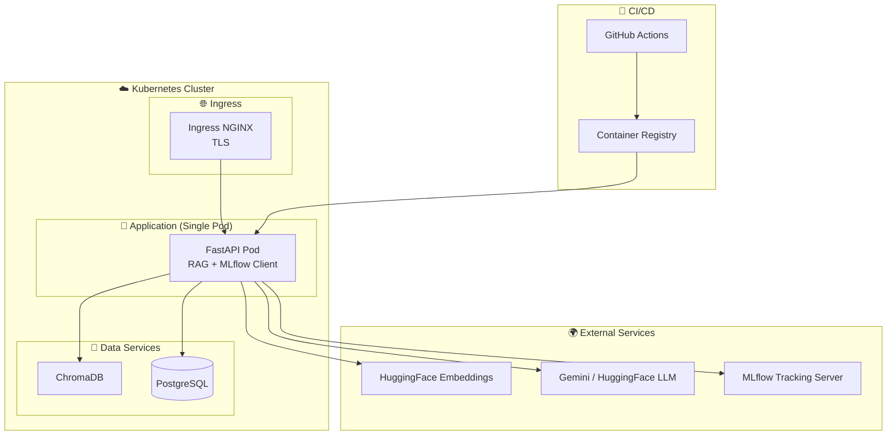

#  RAG IT Support System
[](https://www.python.org/downloads/)
[](https://python.langchain.com/)
[](https://www.trychroma.com/)
[](https://huggingface.co/)
[](https://groq.com/)
[](https://fastapi.tiangolo.com/)
[](https://kubernetes.io/)
[](https://www.docker.com/)
[](https://git-scm.com/)


Système de **Retrieval-Augmented Generation (RAG)** spécialisé pour le support informatique. Il utilise LangChain, ChromaDB et des LLM via API (Groq/Gemini) avec un déploiement robuste sur Kubernetes et une pipeline CI/CD automatisée.

##  Table des matières
- [Aperçu](#aperçu)
- [Fonctionnalités](#fonctionnalités)
- [Structure du Projet](#structure-du-projet)
- [Architecture](#architecture)
- [Installation](#installation)
- [API & Documentation](#api--documentation)
- [CI/CD & Déploiement](#cicd--déploiement)
- [Tests](#tests)

##  Aperçu
Ce projet permet d'automatiser les réponses du support IT en indexant des documents techniques (PDF, guides). L'utilisateur pose une question, le système retrouve les passages pertinents et génère une réponse précise en citant ses sources.

## 🚀 Fonctionnalités
- **Ingestion Intelligente** : Découpage et indexation de documents PDF.
- **Vector Search** : Utilisation de ChromaDB pour une recherche sémantique rapide.
- **LLM Multi-Provider** : Support pour Groq, Gemini ou HuggingFace.
- **Tracking & Monitoring** : Intégration MLflow pour le suivi des performances.
- **Infrastructure Moderne** : Containerisation Docker et orchestration Kubernetes (Scalabilité & Haute disponibilité).

## 📂 Structure du Projet
```text
.
├── .github/workflows/   # Pipeline CI/CD (Tests, Build, Deploy)
├── Tests/               # Tests unitaires, d'intégration et E2E
├── api/                 # Application FastAPI (Endpoints, Schémas)
├── data/                # Stockage des documents et données locales
├── k8s/                 # Manifestes Kubernetes (Deployment, Service, Ingress)
├── ml/                  # Logique Machine Learning & Clustering
├── pipelineRAG/         # Core logic du RAG (Embeddings, Retrieval, Chains)
├── .dockerignore        # Fichiers exclus du build Docker
├── .env.example         # Template des variables d'environnement
├── .gitignore           # Fichiers exclus de Git
├── Dockerfile           # Configuration de l'image Docker
├── README.md            # Documentation principale
├── docker-compose.yml   # Orchestration locale pour le développement
└── requirements.txt     # Dépendances Python
```

##  Architecture System


## 🛠️ Installation

### 1. Cloner le dépôt
```bash
git clone https://github.com/khadija199904/Smartops-RAG-IT-Support.git
cd Smartops-RAG-IT-Support
```

### 2. Configuration de l'environnement
```bash
python -m venv venv
source venv/bin/activate  # Linux/Mac
# ou venv\Scripts\activate pour Windows

pip install -r requirements.txt
cp .env.example .env # Remplissez vos clés API (GROQ, HF, etc.)
```

### 3. Lancer avec Docker Compose
```bash
docker-compose up -d --build
```

##  API & Documentation

Une fois l'application démarrée, l'API est accessible sur le port `8080`. Vous pouvez tester les fonctionnalités via l'interface Swagger UI.

### Interface Swagger (Query Endpoint)


- **Documentation Interactive** : [http://localhost:8080/docs](http://localhost:8080/docs)
- **Point de terminaison Query** : `POST /query` pour poser une question au système.

## CI/CD & Déploiement
Le projet utilise **GitHub Actions** pour :
1. **Linting & Tests** : Vérification automatique du code à chaque push.
2. **Build & Push** : Création de l'image Docker et envoi vers le registre.
3. **Deployment** : Mise à jour automatique du cluster Kubernetes.

##  Tests
Pour garantir la stabilité du système, lancez la suite de tests avec `pytest` :
```bash
pytest Tests/ -v
```

---
